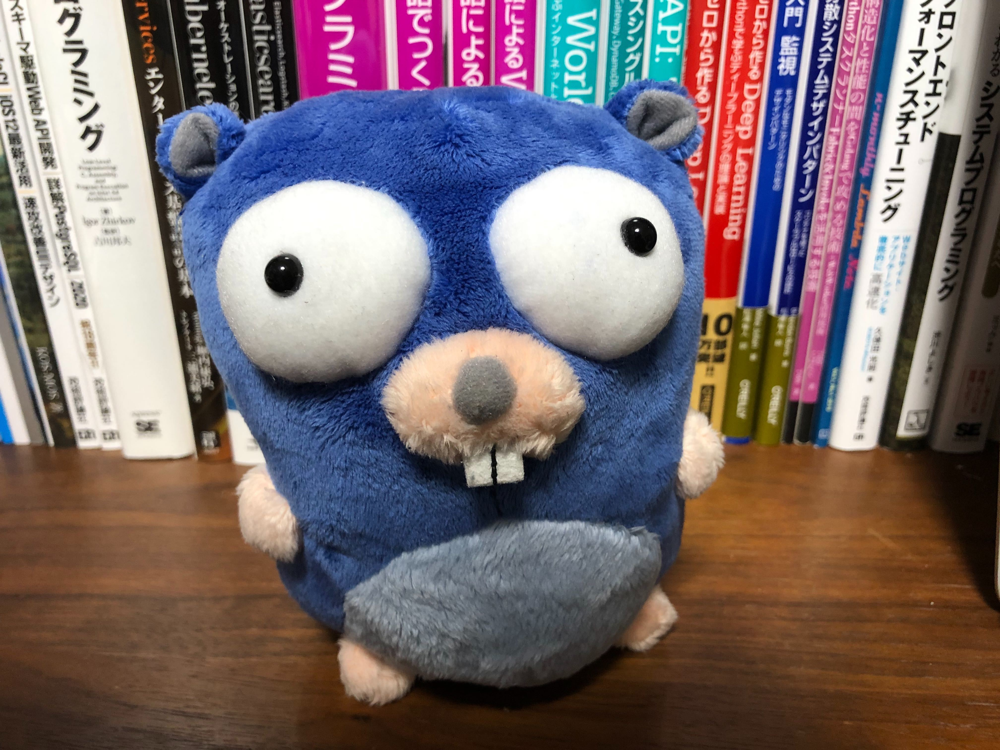
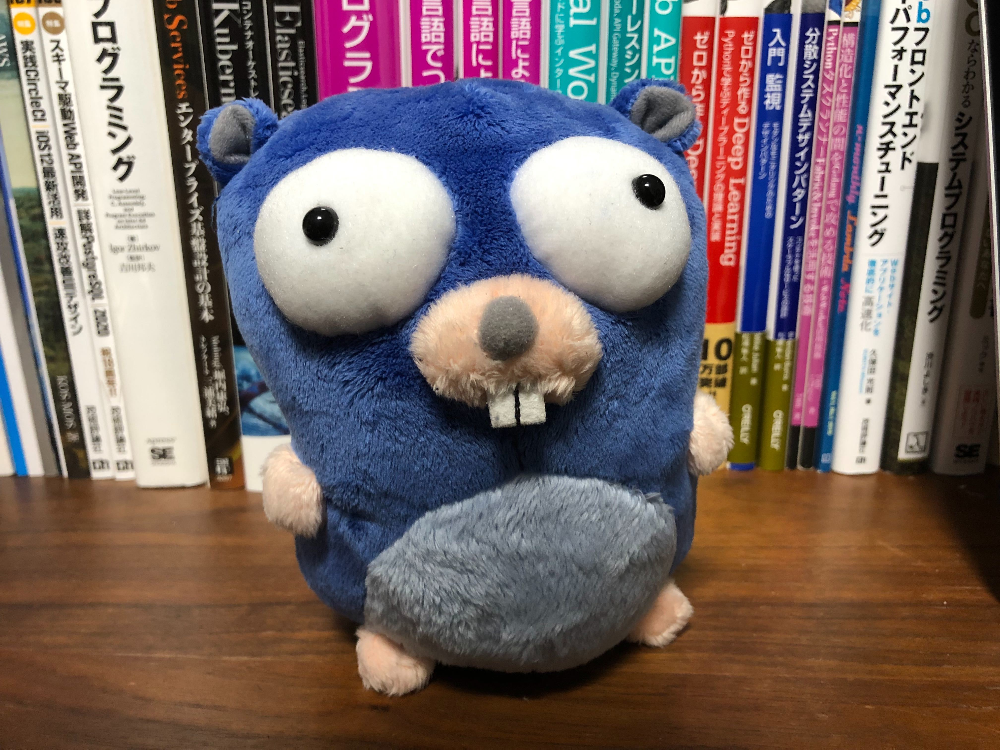

# gosimimg


-----

## What is

### is a similar image ? yes !!




this package determine if it is a similar image using average hash. The average of the luminance values ​​is calculated, and the 64-bit hash value is calculated as “1” for greater than the average and “0” for less than the average.

## Quick Start

```
go get -u github.com/po3rin/gosimimg
gosimimg testdata/sim1_1.jpg testdata/sim1_2.jpg
simmilar !!
```

## As Code

```go
func main() {

    // prepare image.Image
	src1 := gosimimg.GetImage(img1, 8, 8)
	src2 := gosimimg.GetImage(img2, 8, 8)

	if !gosimimg.IsSimilar(src1, src2) {
		fmt.Println("not simmilar !!")
		return
	}
	fmt.Println("simmilar !!")
}
```

## reference(ja)

[類似画像検索について簡単にまとめてみた](https://qiita.com/hurutoriya/items/88a16d36bafa8d6360e2)

[Go言語を使って類似画像を検索する](https://medium.com/eureka-engineering/go%E8%A8%80%E8%AA%9E%E3%82%92%E4%BD%BF%E3%81%A3%E3%81%A6%E9%A1%9E%E4%BC%BC%E7%94%BB%E5%83%8F%E3%82%92%E6%A4%9C%E7%B4%A2%E3%81%99%E3%82%8B-ccb2a0752d04)